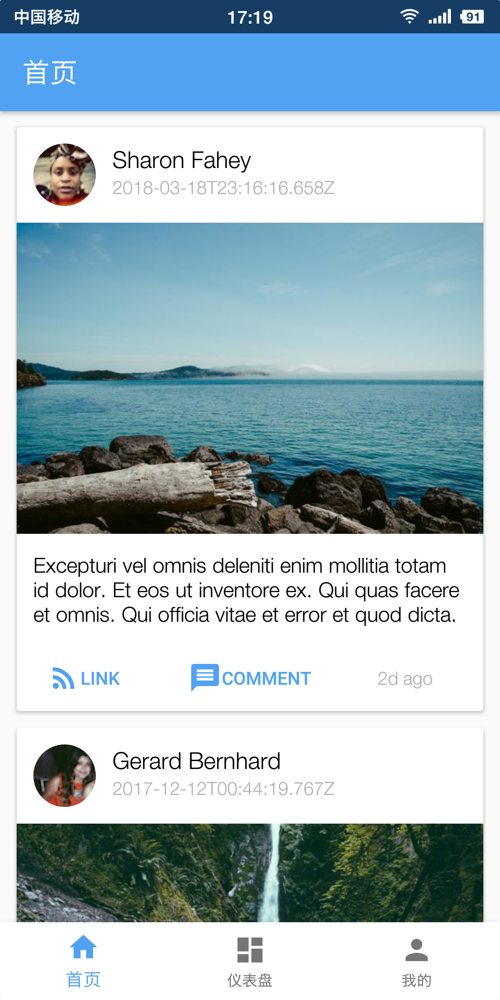

# Android Example

## 使用的第三方库
1. Glide
2. Okhttp
3. ijkPlayer

## 简单例子
1. 使用了底部导航栏切换Fragment
2. 下拉加载新数据与Http接口调用
3. 相册图片选择
4. 通知栏显示通知
5. 应用下载与安装（应用更新）
6. 音频播放
7. 本地数据存储
8. flv视频播放
9. 图片涂鸦

## Material Design Component && Other Support Component
* CardView 卡片 `com.android.support:cardview-v7:28.0.0`
* RecyclerView 列表 `com.android.support:recyclerview-v7:28.0.0`
* SwipeRefreshLayout 下拉刷新/上滑更多
* NestedScrollView 滚动视图
* TabLayout & ViewPager页面切换

## 预览
