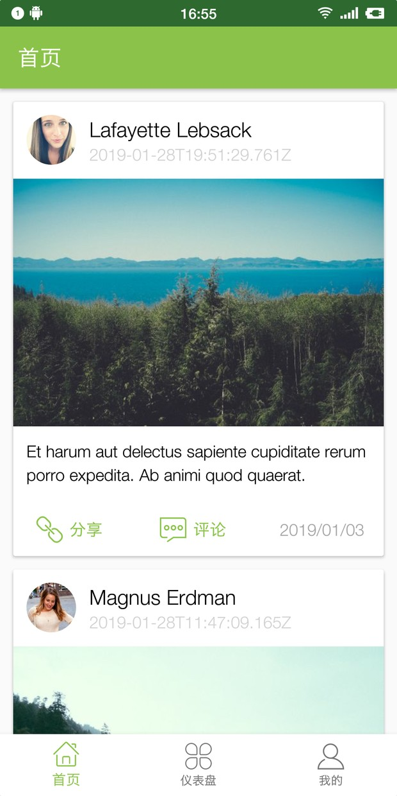

# Android Example

## 使用的第三方库
1. Glide
2. Okhttp
3. ijkPlayer

## 简单例子
1. 使用了底部导航
2. 侧边导航
3. 下拉加载新数据
4. 相册图片选择与涂鸦
5. 通知栏显示通知
6. 应用下载与安装（应用更新）
7. 音频播放
8. flv播放器/弹幕
9. 动画

## Material Design Component && Other Support Component
* CardView 卡片 `com.android.support:cardview-v7:28.0.0`
* RecyclerView 列表 `com.android.support:recyclerview-v7:28.0.0`
* SwipeRefreshLayout 下拉刷新/上滑更多
* NestedScrollView 滚动视图
* TabLayout & ViewPager页面切换
* DrawerLayout 抽屉

## 其它任务
1. 蓝牙，设备通信
2. WIFI直连
3. WebRTC
4. WebSocket
5. 动画、资源文件
6. 投屏
7. 地图

## 参考文档地址
* [Android Example Code](http://hmkcode.com)
* [参考资料](https://github.com/open-android/Android)
* [Book](https://github.com/justjavac/free-programming-books-zh_CN)
* [授权管理](https://github.com/permissions-dispatcher/PermissionsDispatcher)

## 预览
